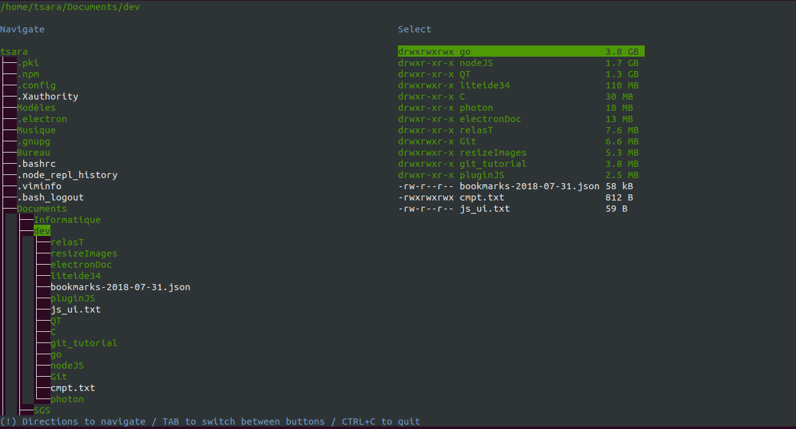
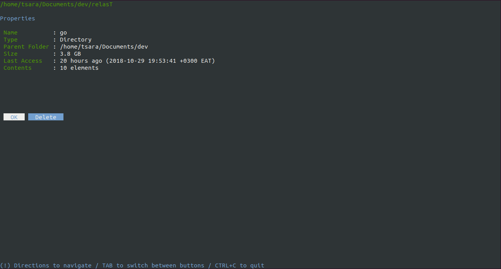
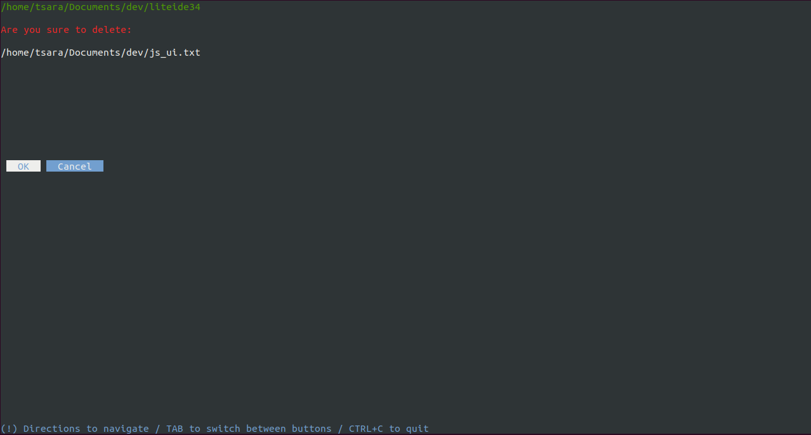

UsedSpace
=========

Console user interface to check space used by files and folders into your disk.

Screeshoots
---




How to use
---

This app is developped in [Go](https://golang.org/doc/install).
It uses:
* [concurrent-map](https://github.com/orcaman/concurrent-map) to use thread-safe concurrent map.
* [go-humanize](https://github.com/dustin/go-humanize) to make size format more readable.
* [times](https://github.com/djherbis/times) to make time format more readable.
* [tview](https://github.com/rivo/tview) to create the console user interface.
* [walk](https://github.com/MichaelTJones/walk) to scan directory in parallel.

Clone or Download this repository.
```
git clone https://github.com/arasT/UsedSpace
```
Extract the archive and move into it.
```
cd UsedSpace
```
Install all needed go packages
```
go get "github.com/orcaman/concurrent-map"
go get "github.com/dustin/go-humanize"
go get "github.com/djherbis/times"
go get "github.com/rivo/tview"
go get "github.com/MichaelTJones/walk"

```

Build
---

Build the executable

```
go build
```

Run
---
You can start the executable using its name following by a directory path to scan.
```
./UsedSpace <directory's path to scan>
```
Or without any path, current directory will be scanned
```
./UsedSpace 
```

Binaries
---
You can use available binaries if you don't want to build.
Check them into [relasT](https://github.com/arasT/relasT) depot, or use the links bellow:
   * [Linux x64](https://github.com/arasT/relasT/raw/master/Go/UsedSpace/Linux/x64/UsedSpace-Linux-x64-0.1.zip) (compiled on Ubuntu) 
   * [Mac x64](https://github.com/arasT/relasT/raw/master/Go/UsedSpace/Mac/x64/UsedSpace-Mac-x64-0.1.zip)  

Keyboard shortcuts
---

* 'Arrow Left' or 'Arrow Right' to switch between tabs.
* 'tab' to switch between buttons
* 'ctrl + c' to quit the app.

License
----

The MIT License.
Further details see LICENSE file.

Miscellanous
----
* Cannot scan root path "/" yet.
* Do not work yet on Windows.

Contributing
----

Please fork if you want to contribut to this project.
